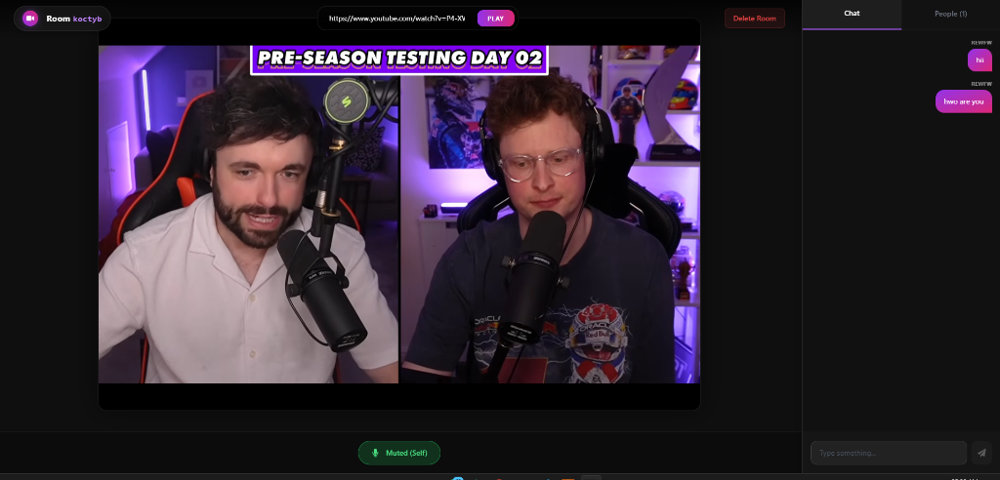

# StreamSync — Real-time Watch Party App

**StreamSync** is a modern, real-time web application that allows users to watch YouTube videos together perfectly synchronized, while chatting via voice and text. Built for low-latency and high engagement.

🔗 **Live Demo:** [https://streamsynclive.vercel.app](https://streamsynclive.vercel.app)




## 🚀 Features

*   **Synchronized Playback:** Play, pause, seek, and change videos in real-time for all users.
*   **Voice Chat:** Crystal clear, low-latency voice chat using WebRTC.
*   **Real-time Messaging:** Instant text chat with socket.io.
*   **Video Calls (State Aware):** See who is speaking with visual indicators.
*   **Room Management:** Create private rooms, host controls (kick/delete), and persistence.
*   **Modern UI:** Dark mode aesthetic with glassmorphism and smooth animations.

## 🛠️ Tech Stack

*   **Frontend:** React (Vite), TypeScript, Tailwind CSS
*   **Backend:** Node.js, Express, Socket.io
*   **Database:** MongoDB (for persistent room states & auth)
*   **Real-time:** WebRTC (`simple-peer`) for voice, Socket.io for events
*   **Deployment:** Vercel (Frontend), Render/Railway (Backend)

## 📦 Installation

Clone the repository:
```bash
git clone https://github.com/mayankhansraj12/youtube-streamer.git
cd youtube-streamer
```

### 1. Backend Setup
Navigate to the server directory and install dependencies:
```bash
cd server
npm install
```

Create a `.env` file in the `server` directory:
```env
PORT=5000
MONGODB_URI=your_mongodb_connection_string
JWT_SECRET=your_jwt_secret
```

Start the server:
```bash
npm run dev
```

### 2. Frontend Setup
Navigate to the client directory and install dependencies:
```bash
cd ../client
npm install
```

Create a `.env` file in the `client` directory:
```env
VITE_BACKEND_URL=http://localhost:5000
```

Start the React app:
```bash
npm run dev
```

## 🚀 Deployment

*   **Frontend:** Deploys seamlessly to Vercel. Includes a `vercel.json` for SPA routing.
*   **Backend:** Deploy to Render, Railway, or any Node.js hosting.

## 🤝 Contributing

Pull requests are welcome. For major changes, please open an issue first to discuss what you would like to change.

## 📄 License

[MIT](https://choosealicense.com/licenses/mit/)
